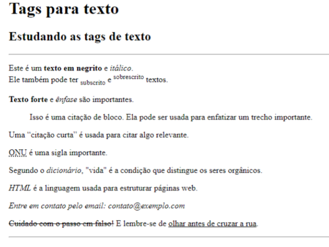
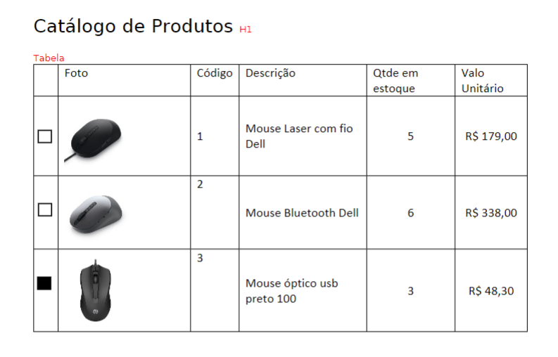
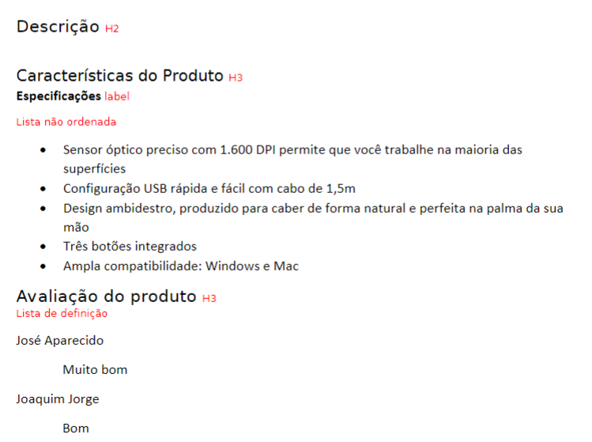
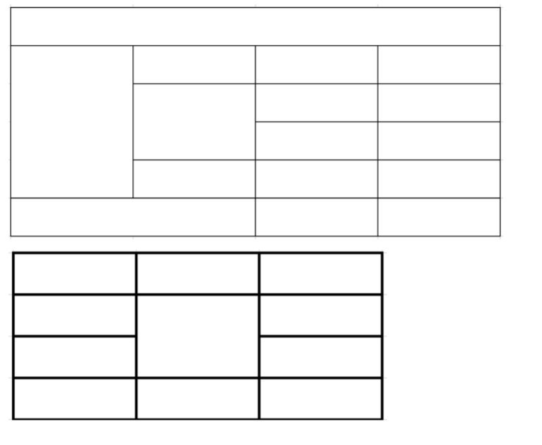

1 - Utilizando as tags para a marcação de texto definidas no slide “4- Web02 HTML 5”, crie uma página html com o formato abaixo:

[Resolução](https://github.com/thaisconto/Curso-ADS/blob/main/JavaScript_Web/Listas/Lista3_HTML_b%C3%A1sico/ex1.html)

2 - Crie a seguinte página abaixo:

[Resolução](https://github.com/thaisconto/Curso-ADS/blob/main/JavaScript_Web/Listas/Lista3_HTML_b%C3%A1sico/ex2.html)

3 – Monte o código necessário para as seguintes tabelas:

[Resolução](https://github.com/thaisconto/Curso-ADS/blob/main/JavaScript_Web/Listas/Lista3_HTML_b%C3%A1sico/ex3.html)

